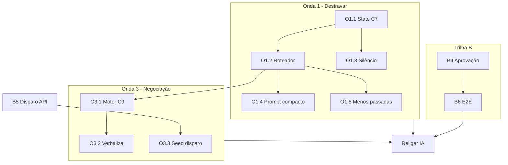

# Plano mestre — Evolução IA GMX (iagmx + portal)

**Criado:** 2026-06-15  
**Dono:** equipe GMX / iagmx  
**Regra de ouro:** decisão de fluxo no **código**; LLM só **redige** o tom. IA **nunca** inventa carga.

> **Agentes Cursor:** leia este arquivo no **início** de toda sessão em `iagmx` ou `gmx` relacionada à IA. Ao terminar um item, marque `[x]`, atualize **Estado agora** e **Log de sessões**. Não pule fases sem critério de saída.

---

## Estado agora (atualizar a cada sessão)

| Campo | Valor |
|-------|--------|
| **IA em produção** | 🔴 PAUSADA (global) — incidente fila 2026-06-15 |
| **Próxima tarefa** | `C1.5` — enriquecer diff, autor e rollback das edições |
| **Bloqueio atual** | Orquestração parcial: prompt principal e OCR no Postgres, mas camadas críticas ainda hardcoded |
| **Plano disparo ERP** | F1–F3 ✅ · F4 ⚠️ · F5 ✅ · F6 ❌ → ver [plano-disparo-ofertas-gmx.md](./plano-disparo-ofertas-gmx.md) |
| **Última atualização** | 2026-06-16 (simulador visual + trilha de orquestração viva) |

### Progresso geral

```
Trilha A (inteligência):  [████░░░░░░] 4/18
Trilha B (produto ERP):   [██████░░░░] 5/8 fases
Trilha C (orquestração):  [██████░░░░] 6/10 fases
Guardrails pós-incidente: [███████░░░] 4/5
```

---

## Por que a IA parece “travada”

| Camada | Hoje | Alvo |
|--------|------|------|
| Ritmo WhatsApp | ✅ debounce, digitando, bolhas | manter |
| Menu saudação | ⚠️ código (1 bolha) | expandir roteador |
| Fluxos C7/C8/C9 | ⚠️ C7+C8 em código; C9 ainda LLM | state machine + 1 passada |
| Negociação | ❌ LLM inventa política | motor min/máx em código |
| Silêncio pós-fechamento | ❌ falha nos testes | regra em código |
| Produto → conversa | ⚠️ disparo API ok, E2E incompleto | F4+F6 |

---

## Protocolo de execução (obrigatório para agentes)

1. **Ler** seção **Estado agora** e a tarefa `Próxima tarefa`.
2. **Implementar só essa tarefa** até o critério de saída passar.
3. **Rodar** teste indicado na tarefa (script ou manual documentado).
4. **Marcar** `[x]` na tarefa; atualizar **Estado agora** e **Log de sessões**.
5. **Avançar** para a próxima tarefa na ordem (não pular dependências).
6. **Nunca** `despausar` IA global sem `G5` concluído.
7. **Nunca** enfileirar resposta de teste para WhatsApp real (`origem: teste`).

---

## Trilha A — Inteligência (iagmx)

### Onda 1 — Destravar conversa (prioridade máxima)

Meta: motorista sente atendente que **sabe o passo**, não robô relendo menu.

| ID | Tarefa | Entrega | Critério de saída | Deps |
|----|--------|---------|-------------------|------|
| O1.1 | **State machine C7** | `fluxo-disponibilidade.ts` + `debounce.ts` | ✅ Script c7-* passa sem LLM; `registrar_disponibilidade` no fluxo feliz | — |
| O1.2 | **Roteador de intenção** | `roteador-intencao.ts` + `debounce.ts` | ✅ `oi`→menu, `disponibilidade`→C7, `cadastro`→entrada, `pagamento`→resposta, oferta→LLM c9 | O1.1 |
| O1.3 | **Silêncio + encerramento** | `mensagem-encerramento.ts` no roteador | ✅ `valeu` pós-fechamento C7 → silêncio | O1.1 |
| O1.4 | **Prompt compacto por cenário** | roteador passa `cenario` → `montarPromptCompactoPassadas` | ⚠️ oferta/cadastro no LLM; demais cenários pendente | O1.2 |
| O1.5 | **Reduzir passadas LLM** | fluxos roteados: 0 passadas | ⚠️ c6+c7+cadastro entrada ok; oferta ainda 3 passadas | O1.2, O1.4 |

**Saída Onda 1:** `node scripts/teste-fluxos-motorista-unico.mjs` com ≥90% validações OK nos fluxos c6+c7.

---

### Onda 2 — Cadastro e contexto

| ID | Tarefa | Entrega | Critério de saída | Deps |
|----|--------|---------|-------------------|------|
| O2.1 | **State machine C8** | `fluxo-cadastro.ts` — passos CNH→CRLV→ANTT→… | ✅ Fluxo `c8-cadastro-inicio` OK; CPF digitado não dispara `grava_ocr` | O1.2 |
| O2.2 | **OCR com retry programático** | após 2 falhas OCR → mensagem fixa + escalonar opcional | Doc [06-cadastro-documentos.md](./referencia-atendimento/06-cadastro-documentos.md) cenário “ilegível” | O2.1 |
| O2.3 | **GPS → cidade** | parser pin Evolution → texto localização | Doc [01-localizacao.md](./referencia-atendimento/01-localizacao.md) variação GPS | O1.1 |
| O2.4 | **Few-shot histórico** | 2–3 exemplos/cenário do JSONL no prompt compacto ou Qdrant | Respostas menos genéricas em simulação (revisão manual 5 turnos) | O1.4 |

**Saída Onda 2:** fluxos c6+c7+c8 passando no script; docs 01+06 marcados ✅.

---

### Onda 3 — Negociação determinística

| ID | Tarefa | Entrega | Critério de saída | Deps |
|----|--------|---------|-------------------|------|
| O3.1 | **Motor C9** | `motor-negociacao.ts` — piso/teto, rodadas, aceite/recusa | `c5-oferta-negociacao`: contraproposta 4800 com teto 4500 → comportamento doc [05](./referencia-atendimento/05-negociacao-frete.md) Opção A | O1.2, rotas-gmx |
| O3.2 | **LLM só verbaliza C9** | templates + 1 passada opcional para tom | Sem `escalonar_negociacao` antes de 3 rodadas (salvo regra explícita) | O3.1 |
| O3.3 | **Seed histórico no disparo** | `disparar-oferta.ts` grava 1ª msg assistant no Redis | Após disparo, IA continua C9 sem perguntar “qual carga?” | B2.2 |

**Saída Onda 3:** fluxos c5-* passando; doc [07-negociacao-portal-rotas.md](./referencia-atendimento/07-negociacao-portal-rotas.md) alinhado.

---

### Onda 4 — Operação contínua

| ID | Tarefa | Entrega | Critério de saída | Deps |
|----|--------|---------|-------------------|------|
| O4.1 | **Cron recontato carregados** | job `data_previsao_disponibilidade` | Doc [03-agenda-quando-libera.md](./referencia-atendimento/03-agenda-quando-libera.md) | O1.1 |
| O4.2 | **Métricas** | log estruturado: fluxo, passo, ferramenta, latência | Endpoint `/api/diagnostico` expõe contadores | O1.2 |
| O4.3 | **Simulação diária** | script CI ou cron + relatório em `scripts/relatorios-simulacao/` | Relatório &lt; 24h em falha bloqueia deploy | O1.5 |
| O4.4 | **Imitação sintaxe histórico** | pipeline JSONL → few-shot dinâmico | Avaliação qualitativa aprovada pelo operador | O2.4 |

---

## Trilha B — Produto ERP → WhatsApp (gmx + iagmx)

Detalhe completo: [plano-disparo-ofertas-gmx.md](./plano-disparo-ofertas-gmx.md)

| ID | Fase | Status | Critério de saída |
|----|------|--------|-------------------|
| B1 | F1 Directus | ✅ | campos embarque + log rota |
| B2 | F2 Correlação | ✅ | import correlaciona ou pendência |
| B3 | F3 CSV kanban | ✅ | botão Embarques |
| B4 | F4 Matching + aprovação | ⚠️ | **nenhum** WhatsApp sem clique; `autoMatching`/n8n desligado |
| B5 | F5 API disparo | ✅ | `POST /api/disparar-oferta` |
| B6 | F6 E2E + doc 04 | ❌ | script `teste-fluxo-disparo` + [04-oferta-carga.md](./referencia-atendimento/04-oferta-carga.md) |

### Tarefas B pendentes (destravar produção)

| ID | Tarefa | Repo | Critério de saída | Deps |
|----|--------|------|-------------------|------|
| B4.1 | Desativar `autoMatching` / n8n disparo | gmx | grep + flag; zero envio automático em log | — |
| B4.2 | Modal oferta só com rank + clique | gmx | já parcial — validar em prod | B4.1 |
| B6.1 | Script E2E disparo | gmx ou iagmx | CSV fake → disparo → simula resposta motorista | B4, B5 |
| B6.2 | Atualizar doc 04 | docs | fluxo definitivo documentado | B6.1 |

**Saída Trilha B:** operador dispara oferta real; IA negocia (Onda 3) em teste E2E.

---

## Trilha C — Orquestração viva de prompts e comandos WhatsApp

Meta: todo texto operacional relevante deve ficar **editável, auditável e versionável**, e operadores autorizados devem conseguir orientar a IA por portal ou por WhatsApp sem editar código.

| ID | Tarefa | Entrega | Critério de saída | Deps |
|----|--------|---------|-------------------|------|
| C1.1 | Inventário de prompts e mensagens | mapa `postgres vs hardcoded vs híbrido` no portal | ✅ operador vê o que já é editável e o que ainda exige deploy | — |
| C1.2 | Externalizar `CAMADA_HUMANA` | mover `camada-humana.ts` para configuração versionada | ✅ portal salva, backend recarrega sem deploy | C1.1 |
| C1.3 | Externalizar formatação e OCR forçado | `instrucaoFormatacao` e `OCR_PROMPT_FORCADO` saem do código | ✅ regras de WhatsApp e fallback OCR já podem ser persistidas sem deploy | C1.1 |
| C1.4 | Externalizar mensagens fixas de fluxos | textos de C7/C8/atualização/canhoto/OCR humano em coleção configurável | ✅ trocar texto operacional principal já não exige alteração no fonte | C1.1 |
| C1.5 | Versionamento e diff de prompt | histórico com autor, antes/depois e rollback | ⚠️ histórico com antes/depois e carimbo já existe; faltam autor explícito, diff melhor e rollback | C1.2, C1.3 |
| C2.1 | Canal professor por WhatsApp | números autorizados com papel `professor_prompt` | só números whitelist podem emitir ordens | C1.5 |
| C2.2 | Professor por áudio | áudio do professor → STT → comando estruturado | ordem por áudio é transcrita e submetida à confirmação | C2.1 |
| C2.3 | Tools de edição de prompt via conversa | comandos tipo `adicionar regra`, `substituir trecho`, `listar prompt`, `mostrar diff` | backend confirma intenção antes de persistir mudança | C2.1 |
| C2.4 | Escopo e confirmação | edição escolhe alvo: prompt principal, OCR, camada humana, fluxo específico | nenhuma alteração ambígua é aplicada sem confirmação explícita | C2.3 |
| C2.5 | Sandbox e publicação | mudança pode ser testada no simulador antes de publicar | operador valida em simulação e então promove para produção | C1.5, C2.3 |
| C2.6 | Professor auditor por botão ou WhatsApp | comando `avaliar jornadas` no portal ou vindo de número autorizado | IA lê históricos de teste e devolve parecer com pontos fortes, riscos e sugestão de ajuste | C2.1 |
| C2.7 | Parecer cíclico multi-jornada | rotina que varre todas as jornadas planejadas e emite opinião com bom senso | relatório consolidado por cenário, com nota, crítica e recomendação | C2.6 |

### Observações de arquitetura da Trilha C

- Hoje `prompt_sistema` e `prompt_ocr` já vivem na tabela `configuracao` do Postgres
- Ainda estão **hardcoded** no código principalmente várias mensagens fixas dos fluxos programáticos
- O alvo da trilha é transformar essas camadas em **assets orquestráveis**, com versionamento, autorização e trilha de auditoria
- O canal “professor” deve ser tratado como **comando sensível**, nunca como mensagem comum de motorista
- O professor auditor precisa ler **históricos de teste**, não só mensagens isoladas, para avaliar qualidade de atendimento com contexto completo
- A análise do professor deve ser **cíclica**: rodar por botão no portal, por comando WhatsApp autorizado e também após novas baterias de simulação

**Saída Trilha C:** operador consegue editar prompts e textos operacionais pelo portal ou por WhatsApp autorizado, com confirmação, auditoria e possibilidade de rollback.

---

## Guardrails — pós-incidente 2026-06-15

| ID | Guardrail | Status | Arquivo / nota |
|----|-----------|--------|----------------|
| G1 | Fila TTL 15 min + descarte na drenagem | ✅ | `fila-respostas.ts`, `fila-respostas-worker.ts` |
| G2 | Teste API não envia WhatsApp (`origem: teste`) | ✅ | `enviar-resposta.ts`, `debounce.ts` |
| G3 | `/api/debounce/test` só prefixos teste | ✅ | `debounce-admin.ts` |
| G4 | Menu 1 bolha (`fragmentar: false`) | ✅ | `respostas-menu.ts` |
| G5 | Checklist antes de despausar global | ❌ | ver abaixo |

### Checklist G5 — religar IA em produção

- [ ] Onda 1 concluída (c6+c7 estáveis)
- [ ] Fila Redis vazia (`GET /api/fila-respostas` → total 0)
- [ ] WhatsApp conectado; Chatwoot **desvinculado** do mesmo número
- [ ] B4.1 autoMatching desligado
- [ ] Teste manual: 1 número interno — `oi` → menu 1 bolha; `disponibilidade` → C7 sem repetir menu
- [ ] Aprovação explícita do operador (Edu)

---

## Mapa de dependências (visual)



---

## Testes de regressão (rodar antes de marcar onda concluída)

| Comando | Quando |
|---------|--------|
| `node scripts/teste-fluxos-motorista-unico.mjs` | Após O1, O2, O3 |
| `node scripts/teste-completo.mjs` | Antes de deploy container |
| `GET /api/fila-respostas` (admin) | Sempre antes de despausar |
| E2E disparo (B6.1) | Antes de produção com ofertas |

Relatórios salvos em: `scripts/relatorios-simulacao/`

---

## Referência de comportamento esperado

| Doc | Situação |
|-----|----------|
| [01-localizacao](./referencia-atendimento/01-localizacao.md) | Cidade / GPS |
| [02-disponibilidade](./referencia-atendimento/02-disponibilidade-vazio-carregado.md) | Vazio vs carregado |
| [03-agenda](./referencia-atendimento/03-agenda-quando-libera.md) | Data liberação |
| [04-oferta](./referencia-atendimento/04-oferta-carga.md) | Disparo proativo |
| [05-negociacao](./referencia-atendimento/05-negociacao-frete.md) | Piso/teto |
| [06-cadastro](./referencia-atendimento/06-cadastro-documentos.md) | Docs + OCR |
| [07-portal-rotas](./referencia-atendimento/07-negociacao-portal-rotas.md) | config_rotas |

---

## Log de sessões (agente: adicione linha ao trabalhar)

| Data | Tarefa | Resultado | Próximo |
|------|--------|-----------|---------|
| 2026-06-16 | C1.3 OCR fallback | `OCR_PROMPT_FORCADO` também saiu do hardcode operacional e passou a ser persistido na `configuracao`, com leitura no retry de OCR | C1.4 |
| 2026-06-16 | C1.4 concluído | mensagens de disponibilidade, cadastro, atualização documental, canhoto e OCR humano passaram a ser lidas de `configuracao.mensagens_fluxo`, com editor JSON inicial no portal | C1.5 |
| 2026-06-16 | C1.5 iniciado | backend ganhou `configuracao_historico` com registro de mudanças em prompt, OCR, orquestração e mensagens de fluxo; portal passou a listar antes/depois recentes | C1.5 |
| 2026-06-16 | C1.4 parcial | mensagens de disponibilidade, cadastro, atualização documental e OCR humano passaram a ser lidas de `configuracao.mensagens_fluxo`, com editor JSON inicial no portal | C1.4 |
| 2026-06-16 | C1.2 + portal | `CAMADA_HUMANA` e `instrucaoFormatacao` passaram a ter configuração persistida em Postgres com editor no portal; simulador agora lê prompts, traces e inventário de hardcoded vs Postgres | C1.3 |
| 2026-06-16 | Trilha C + simulador | portal ganhou simulador visual; inventário mostrou `prompt_sistema` e `prompt_ocr` no Postgres, mas `CAMADA_HUMANA`, `instrucaoFormatacao`, `OCR_PROMPT_FORCADO` e textos de fluxo ainda hardcoded; trilha C criada para orquestração viva e professor via WhatsApp | C1.2 |
| 2026-06-15 | Contexto ERP | `contexto-erp-motorista.ts`: motorista+docs+embarque+histórico sempre no prompt; `fluxo-atualizar-documento.ts` | O2.2 |
| 2026-06-15 | O2.1 | State machine C8: CNH→CRLV→ANTT→endereço→caminhão em código, 0 passadas LLM, teste c8 OK | O2.2 |
| 2026-06-15 | O1.2+O1.3 | Roteador central + silêncio pós-fechamento + cadastro/pagamento programáticos | O2.1 |
| 2026-06-15 | O1.1 | State machine C7: vazio/carregado/local/data em código, 0 passadas LLM, deploy | O1.2 |
| 2026-06-15 | — | Plano mestre criado; IA pausada; guardrails G1–G4 | O1.1 |

---

## Definição de “pronto para produção” (visão completa)

1. Operador dispara oferta no kanban (B4+B6) — único caminho de proatividade  
2. IA conduz disponibilidade (O1) e negociação (O3) sem travar nem repetir menu  
3. Cadastro coleta docs com state machine (O2)  
4. Silêncio correto após fechamento (O1.3)  
5. Guardrails G1–G5 ativos; zero fila antiga; incidente não se repete  
6. Simulação automatizada verde (O4.3)
